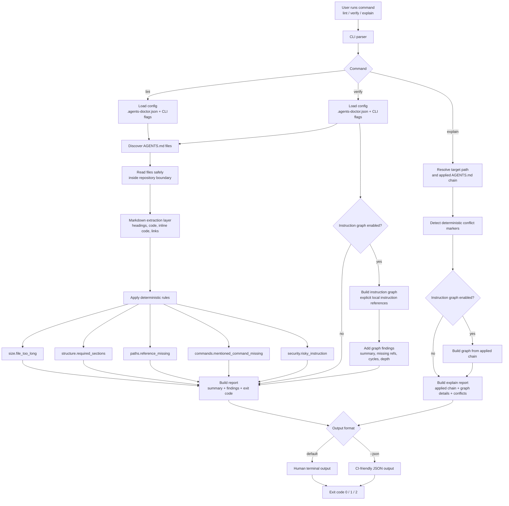

# How AGENTS.md Doctor Works

AGENTS.md Doctor is a deterministic validator for instruction files used by AI
coding agents.

It never executes commands from `AGENTS.md`. It only inspects file content,
paths, command references, and policy signals.

## Architecture Flow



## Output Example

```text
agents-doctor lint: 1 warning

warning size.file_too_long AGENTS.md:1
AGENTS.md has 501 lines. Recommended maximum: 500 lines.
```

## Instruction Graph

The instruction graph is opt-in through `.agents-doctor.json`. When enabled,
`verify` and `explain` follow explicit local Markdown links and inline-code
references that look like agent instruction files, such as
`docs/agent/testing.md`, `.claude/commands/review.md`, or
`.cursor/rules/react.md`.

The graph builder does not scan all documentation, follow remote URLs, follow
symlinks, or read files outside the repository boundary.
